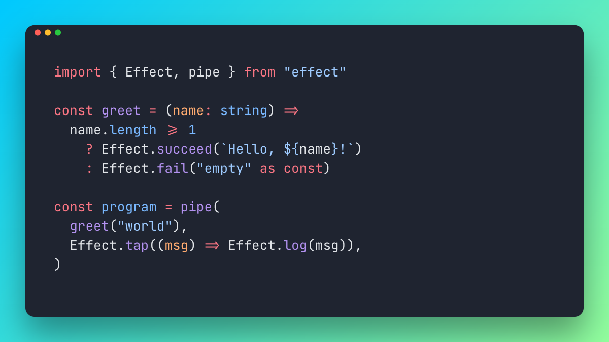

# code hübsch

Tweet-ready code images. Paste in a snippet, pick a theme and font, export a clean PNG.

**Try it out → [codehubsch.com](https://codehubsch.com)**

<p align="center">
  
</p>

## Features

- 🔤 Ligature support
- 🎨 30+ bundled programming fonts
- 📐 SVG & PNG export
- 📜 Multi-page export for long snippets
- 🐦 Tweet, OG and slide presets
- ✨ Auto-fit height
- 🌫️ Transparent canvas
- 🧪 HTML-in-Canvas renderer
- 🔒 No signup, open source

## Development

```bash
pnpm install
pnpm dev      # vite dev server on :3000
pnpm build    # production build via Nitro
pnpm preview  # preview the build
pnpm test     # vitest
pnpm check    # biome lint + format
```

## License

[MIT](./LICENSE) © Betalyra Sociedade Unipessoal Lda.
